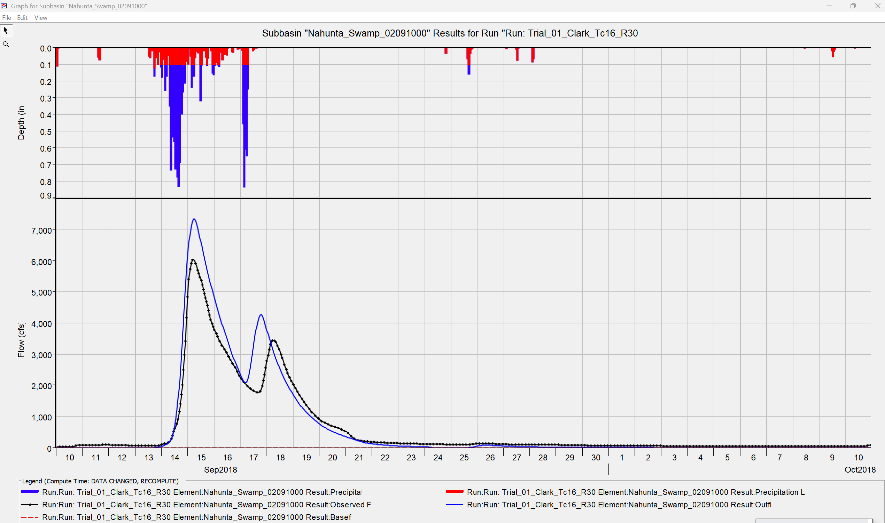
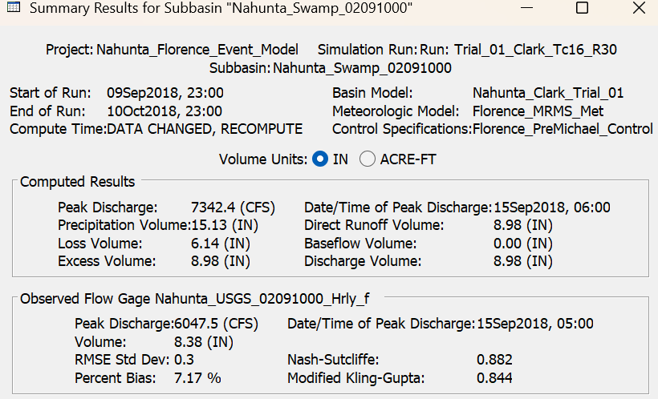

# Hurricane Florence Rainfall–Runoff Event Reconstruction for Nahunta Swamp, North Carolina

## Project Overview

This project develops a reproducible hydrologic-modeling workflow for evaluating watershed response to extreme rainfall associated with Hurricane Florence in September 2018.

The final model represents **Nahunta Swamp near Shine, North Carolina**, using:

* A verified outlet-specific watershed boundary.
* Hourly NOAA MRMS gauge-corrected precipitation estimates.
* U.S. Geological Survey discharge observations.
* Python-based data processing and quality-control workflows.
* A baseline HEC-HMS rainfall–runoff simulation.

The workflow was designed as a professional portfolio project demonstrating watershed delineation, precipitation processing, discharge quality control, hydrologic model setup, parameter refinement, and defensible model-selection decisions.

## Final Study Site

| Item                     | Selection                                                                           |
| ------------------------ | ----------------------------------------------------------------------------------- |
| Watershed                | Nahunta Swamp near Shine, North Carolina                                            |
| USGS Gauge               | 02091000 — Nahunta Swamp near Shine, NC                                             |
| Published Drainage Area  | 80.40 square miles                                                                  |
| Calculated Boundary Area | 79.80 square miles                                                                  |
| Boundary Method          | USGS NLDI point-specific basin delineation with `splitCatchment=true`               |
| Storm Event              | Hurricane Florence, September 2018                                                  |
| Analysis Window          | September 10 through October 10, 2018, ending before Tropical Storm Michael impacts |
| Rainfall Product         | NOAA MRMS `GaugeCorr_QPE_01H`                                                       |
| Hydrologic Model         | HEC-HMS lumped event-reconstruction model                                           |

## Research Objective

The objective of this project is to reconstruct the rainfall–runoff response of a small coastal-plain watershed during Hurricane Florence and evaluate whether externally processed precipitation and observed discharge data support a defensible event-based HEC-HMS simulation.

## Site-Selection Quality Control

The project initially evaluated the **Trent River near Trenton, NC** watershed, USGS gauge 02092500. A verified StreamStats boundary closely matched the published basin area; however, the official discharge volume for the Florence response period substantially exceeded the processed MRMS rainfall depth in watershed-equivalent units.

Because that result was physically inconsistent for a simple closed-basin rainfall–runoff calibration, the Trent River site was retained only as a documented screening case and was not used for the final model.

Nahunta Swamp was then evaluated as a replacement site. It passed the initial hydrologic plausibility screening:

| Screening Metric                                       |        Nahunta Swamp Result |
| ------------------------------------------------------ | --------------------------: |
| Published drainage area                                |                   80.40 mi² |
| Calculated boundary area                               |                   79.80 mi² |
| Boundary-area difference                               |                      −0.75% |
| Complete basin-average MRMS rainfall depth             |                    15.13 in |
| Official daily above-baseline discharge depth          |                     7.45 in |
| Daily discharge-depth / rainfall-depth screening ratio |                       0.492 |
| Site-selection decision                                | Proceed to HEC-HMS modeling |

This screening step is a central part of the project: the final watershed was selected only after its rainfall and discharge records passed a basic physical plausibility check.

## Data Sources

| Dataset                        | Source                                                                   | Use in Project                            |
| ------------------------------ | ------------------------------------------------------------------------ | ----------------------------------------- |
| Hourly precipitation           | NOAA Multi-Radar/Multi-Sensor System, Gauge-Corrected QPE 1-hour product | Rainfall forcing for the HEC-HMS model    |
| Continuous and daily discharge | USGS Water Data for the Nation, gauge 02091000                           | Observed hydrograph and volume screening  |
| Watershed boundary             | USGS Network Linked Data Index point-specific delineation                | Basin geometry and precipitation clipping |
| Hydrologic model software      | U.S. Army Corps of Engineers HEC-HMS 4.13                                | Rainfall–runoff event reconstruction      |

## Workflow

The project workflow consisted of the following steps:

1. Identify candidate Hurricane Florence watersheds with USGS streamflow observations.
2. Delineate and validate outlet-specific watershed boundaries against published drainage areas.
3. Acquire and process hourly MRMS precipitation grids.
4. Compute basin-average precipitation time series from the verified watershed boundary.
5. Download and quality-check USGS daily and continuous discharge records.
6. Screen candidate sites using rainfall-versus-discharge volume plausibility checks.
7. Prepare hourly precipitation and observed-flow time series for HEC-HMS.
8. Construct and run a lumped HEC-HMS event-reconstruction model.
9. Refine Clark Unit Hydrograph routing parameters to improve peak magnitude and timing.

## Rainfall and Streamflow Processing

For the selected Nahunta Swamp basin:

* **744 hourly MRMS grids** were processed for the period from September 10 through October 10, 2018.
* The resulting basin-average precipitation depth was **15.13 inches**.
* The hourly USGS discharge series contained **20 isolated one-hour gaps**.
* Those isolated gaps were linearly interpolated only for continuous hydrograph comparison and were explicitly flagged in the processed output.
* The completed hourly series was checked against official USGS daily mean discharge values.

The completed-hourly and official-daily discharge volumes were highly consistent:

| Volume Check                               |  Result |
| ------------------------------------------ | ------: |
| Completed-hourly total flow depth          | 8.38 in |
| Official-daily total flow depth            | 8.36 in |
| Completed-hourly above-baseline flow depth | 7.48 in |
| Official-daily above-baseline flow depth   | 7.45 in |
| Completed-hourly screening ratio           |   0.494 |
| Official-daily screening ratio             |   0.492 |

## HEC-HMS Model Configuration

The baseline model uses a single lumped subbasin representing the verified Nahunta Swamp watershed.

| Model Component      | Configuration                             |
| -------------------- | ----------------------------------------- |
| Unit System          | U.S. Customary                            |
| Basin Area           | 80.40 mi²                                 |
| Computation Interval | 1 hour                                    |
| Precipitation Method | Specified Hyetograph                      |
| Rainfall Input       | Hourly basin-average MRMS precipitation   |
| Loss Method          | Initial and Constant                      |
| Transform Method     | Clark Unit Hydrograph                     |
| Baseflow Method      | None for the retained baseline simulation |
| Observed Flow Input  | Hourly USGS discharge comparison series   |

A preliminary recession-baseflow run was rejected because it generated excessive baseflow volume. The retained model therefore focuses on direct-runoff event reconstruction and avoids overstating baseflow representation.

## Retained HEC-HMS Simulation Result

The retained parameter-refined model run is:

```text
Trial_01_Clark_Tc16_R30
```

Key model settings:

| Parameter                         |      Value |
| --------------------------------- | ---------: |
| Initial Loss                      |    0.50 in |
| Constant Loss Rate                | 0.10 in/hr |
| Clark Time of Concentration, `Tc` |      16 hr |
| Clark Storage Coefficient, `R`    |      30 hr |
| Baseflow                          |       None |

### Model Performance

| Performance Metric  |            Simulated |             Observed |
| ------------------- | -------------------: | -------------------: |
| Peak discharge      |          7,342.4 cfs |          6,047.5 cfs |
| Peak discharge time | Sep. 15, 2018, 06:00 | Sep. 15, 2018, 05:00 |
| Discharge volume    |              8.98 in |              8.38 in |

| Evaluation Statistic            |  Value |
| ------------------------------- | -----: |
| Peak timing error               | 1 hour |
| Percent Bias                    |  7.17% |
| Nash–Sutcliffe Efficiency       |  0.882 |
| Modified Kling–Gupta Efficiency |  0.844 |

The official USGS instantaneous Florence peak of **6,060 cfs** at approximately **04:30 EDT on September 15, 2018** was retained as an external peak benchmark. The HEC-HMS comparison series uses hourly discharge values, so the hourly observed peak differs slightly from the instantaneous reference value.

## Final Hydrograph Result



### HEC-HMS Performance Summary



The parameter-refined Clark routing trial substantially improved the initial hydrograph simulation by reducing an overly sharp simulated peak and aligning the modeled peak timing with the observed response.

## Repository Structure

```text
data/
  raw/
    rainfall/                         # Local MRMS source grids; excluded from GitHub
    streamflow/
    watershed/
  processed/
    final_model/
      nahunta_swamp/
        hec_hms_inputs/               # Prepared precipitation and discharge inputs
    site_screening/
      nahunta_swamp/                  # Screening-stage processed data

figures/
  final_model/
    nahunta_swamp/
      calibration_runs/               # Initial and retained HEC-HMS simulation results
      nahunta_hec_hms_input_time_series_quality_control.png
      nahunta_hourly_rainfall_streamflow_quality_control.png

hec_hms/
  Nahunta_Florence_Event_Model/       # HEC-HMS project files

references/

results/
  final_model/
    nahunta_swamp/                    # Final input-preparation and model summaries
  site_screening/
    nahunta_swamp/                    # Site plausibility screening outputs
    trent_river_rejected/             # Documented rejected-candidate results

src/                                  # Python scripts for acquisition, QC, and processing
```

## Key Outputs

| Output                                                             | Description                          |
| ------------------------------------------------------------------ | ------------------------------------ |
| `nahunta_swamp_usgs_02091000_nldi_splitcatchment_basin.geojson`    | Accepted watershed boundary          |
| `nahunta_mrms_hourly_basin_average_rainfall_20180910_20181010.csv` | Hourly rainfall forcing series       |
| `hec_hms_nahunta_hourly_precipitation_inches.csv`                  | HEC-HMS precipitation input          |
| `hec_hms_nahunta_hourly_observed_flow_cfs.csv`                     | HEC-HMS observed-flow input          |
| `nahunta_hec_hms_input_preparation_summary.txt`                    | Final time-series QC summary         |
| `trial_01_clark_tc16_r30_hydrograph.png`                           | Retained model hydrograph comparison |
| `trial_01_clark_tc16_r30_summary_table.png`                        | Retained model performance summary   |

## Limitations

This project is an event-reconstruction model for a single extreme storm and should not be interpreted as a fully validated predictive flood model.

Important limitations include:

* Calibration and assessment are based on one event.
* MRMS precipitation uncertainty was not independently evaluated against local rain-gage observations.
* Twenty isolated hourly discharge gaps were interpolated for continuous hydrograph comparison.
* The retained baseline model does not attempt a detailed groundwater or wetland-storage representation.
* Independent validation using a second storm event was not completed.

## Recommended Next Steps

Future work could include:

1. Validate the model against an additional storm event.
2. Compare MRMS rainfall estimates against available local rain-gage observations.
3. Evaluate alternative loss and baseflow representations.
4. Assess spatial rainfall variation using a limited subbasin configuration.
5. Develop synthetic rainfall scenarios for flood-response sensitivity testing.

## Relevance to Hydrology and Inland Hazard Modeling

This project demonstrates applied skills relevant to hydrologic and inland-flood hazard analysis, including:

* Watershed delineation and drainage-area validation.
* Gridded precipitation processing and basin averaging.
* Streamflow data retrieval and quality control.
* Physical plausibility screening before model calibration.
* HEC-HMS event-model construction and parameter refinement.
* Clear documentation of rejected assumptions, model limitations, and defensible results.
